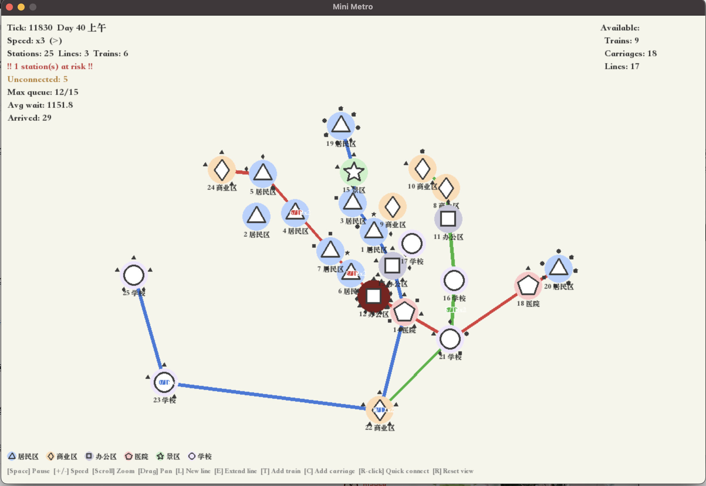
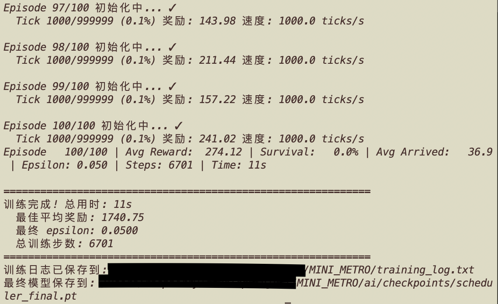

# MINI METRO

地铁线路与资源规划模拟系统





## 项目结构

```
MINI_METRO/
├── core/                      # 核心游戏逻辑
│   ├── station.py            # 站点类
│   ├── line.py               # 线路类
│   ├── train.py              # 列车类
│   ├── carriage.py           # 车厢类
│   ├── passenger.py          # 乘客类
│   ├── passengerManager.py   # 乘客管理器
│   ├── trainInventory.py     # 列车库存管理
│   ├── timer_scheduler.py    # 定时调度器
│   ├── route_planner.py      # 路径规划器
│   └── external_functions.py # 外部函数
│
├── world/                     # 世界运行文件
│   ├── world.py              # 基础世界类
│   ├── run.py                # 地铁世界运行
│   ├── ai_world.py           # AI训练世界
│   ├── game_config.py        # 游戏配置
│   ├── city_generator.py     # 城市生成器
│   └── map_data.py           # 地图数据结构
│
├── ai/                        # AI设计文件
│   ├── src/                   # AI源码
│   │   ├── action_executor.py
│   │   ├── action_space.py
│   │   ├── dqn_agent.py
│   │   ├── dueling_dqn.py
│   │   ├── replay_buffer.py
│   │   ├── reward.py
│   │   ├── scheduler_encoder.py
│   │   └── train_scheduler.py
│   └── checkpoints/           # AI模型检查点
│
├── maps/                      # 地图文件夹
│   └── simple_two_line.json  # 示例地图
│
├── game/                      # 可运行的游戏文件
│   ├── main.py               # 游戏入口
│   └── visualizer.py         # 可视化渲染器
│
└── tests/                     # 测试文件
    ├── test_all.py
    ├── test_shunt.py
    └── test_passenger_alight.py
```

## 程序说明

系统分为两部分：

1. 地铁模拟系统，通过自动生成乘客、站点和自动运行的列车在模拟系统里运行

2. AI调度系统，基于条件规划和机器学习

### AI训练资源配置

AI训练世界使用以下资源配置：
- **最大线路数**: 4条
- **最大列车数**: 8辆
- **最大车厢数**: 8个
- **游戏结束条件**: 当任何站点等待乘客超过50人时游戏结束
- **初始资源**: 世界初始化时一次性给齐所有列车和车厢，AI需自行决定如何分配

20260418 AI支持从零开始学习调度，初始不放置任何列车，由AI自主决策

世界设定
* 乘客随机生成，但在早晚会有从居民区往返写字楼区和商业区的高峰期，模拟现实的早晚高峰
* 乘客会在生成时生成目的地，且乘客只走最短路径去目的地
* 同一条线路的列车不会同时到站，相距至少一个站间
* 居民区、写字楼区会倾向于各自生成在一起，医院则单独分布
* 调度车辆会强制所有乘客在下一站下车，并重新规划他们的路线

## 文件说明

### 核心模块 (core/)

- `station.py` - 站点类，表示地铁站的信息和状态，支持功能类别（居民区/商业区/办公区/医院/景区/学校）
- `line.py` - 线路类，管理地铁线路和站点关系，支持动态添加/插入/移除站点
- `train.py` - 列车类，管理列车状态、车厢和运行逻辑
- `carriage.py` - 车厢类，表示载客的车厢
- `passenger.py` - 乘客类，管理乘客状态、路径规划和行为
- `passengerManager.py` - 乘客管理器，负责生成乘客和处理上下车逻辑
- `trainInventory.py` - 列车库存管理器，管理所有列车和车厢资源
- `route_planner.py` - 路径规划器，为乘客计算最优路径
- `timer_scheduler.py` - 定时调度器，管理列车状态转换的定时事件
- `external_functions.py` - 外部函数模块，包含各种时间计算函数

### 世界运行模块 (world/)

- `world.py` - 游戏世界类，管理站点、线路和整体游戏状态
- `run.py` - 完整的游戏运行器，使用城市生成器创建初始站点，包含玩家操作接口和观察接口
- `ai_world.py` - AI训练专用世界，一次性生成所有资源，支持日调度运行，支持从MapData加载地图
- `game_config.py` - 游戏配置类，集中管理所有可调参数（站点类别、日调度乘客生成、资源增长、时间计算、可视化等）
- `city_generator.py` - 城市生成器，按类别聚集生成初始城市站点布局
- `map_data.py` - 地图数据结构，封装站点、线路、资源信息，支持序列化/反序列化

### AI模块 (ai/)

- `src/action_executor.py` - 动作执行器，将动作编号翻译成游戏操作
- `src/action_space.py` - 动作空间定义
- `src/dqn_agent.py` - DQN智能体
- `src/dueling_dqn.py` - Dueling DQN网络结构
- `src/replay_buffer.py` - 经验回放缓冲区
- `src/reward.py` - 奖励计算器
- `src/scheduler_encoder.py` - 状态编码器
- `src/train_scheduler.py` - 列车调度器训练脚本
- `checkpoints/` - AI模型检查点目录

### 游戏运行模块 (game/)

- `main.py` - 游戏入口，初始化一个小的世界进行演示
- `visualizer.py` - pygame可视化模块

### 测试文件 (tests/)

- `test_all.py` - 综合测试所有模块功能
- `test_shunt.py` - 专门测试调车功能
- `test_passenger_alight.py` - 测试乘客下车/换乘逻辑

## 用户操作指南

### 运行游戏

1. 运行可视化游戏（推荐）：
   ```bash
   python game/main.py --visual
   ```
   依赖：`pip install pygame`

2. 运行AI训练：
   ```bash
   # 训练AI调度器
   python ai/src/train_scheduler.py --episodes 5000
   
   # 评估训练好的模型
   python ai/src/train_scheduler.py --eval --model ai/checkpoints/best_scheduler.pt
   
   # 可视化AI决策过程
   python visualize_ai_decision.py --model ai/checkpoints/best_scheduler.pt
   ```

3. 运行测试：
   ```bash
   python tests/test_all.py
   python tests/test_shunt.py
   python tests/test_passenger_alight.py
   ```

## 游戏更新机制

按游戏刻来更新.

每一刻需要更新的有:

- 地图:根据日调度按时段和 O-D 流量模式生成乘客（淡化动态站点生成）
- 已有站点:按类别和时段安排乘客出行
- 车辆状态:行驶或上客落客
- 资源增长:按配置定期发放列车/车厢/线路额度

## 站点类别系统

站点分为 6 个功能类别，每个类别对应独特形状：

| 类别 | en          | 形状 | 典型客流 |
|------|-------------|------|---------|
| 居民区 | residential | triangle | 早高峰出发，晚高峰到达 |
| 商业区 | commercial  | diamond | 午间/晚间高峰 |
| 办公区 | office      | square | 早高峰到达，晚高峰出发 |
| 医院 | hospital    | pentagon | 全天少量客流 |
| 景区 | scenic      | star | 晚间出发/到达 |
| 学校 | school      | circle | 早高峰到达，晚高峰出发 |

城市生成器在游戏开始时按类别聚集生成 18-20 个站点，AI/玩家需要立即规划线路。

## 日调度乘客生成

一天 = 300 ticks，分为 7 个时段：

| 时段 | 大致对应 | 主要 O-D 方向 |
|------|---------|--------------|
| 夜间 | 0:00-5:00 | 极少量，居民→医院 |
| 早高峰 | 5:00-8:24 | 居民区→办公区/学校 |
| 上午 | 8:24-12:00 | 办公→商业，医院→居民 |
| 午间 | 12:00-14:24 | 办公→商业(午餐) |
| 晚高峰 | 14:24-18:00 | 办公→居民区，学校→居民 |
| 晚间 | 18:00-21:07 | 商业→居民，景区→居民 |
| 深夜 | 21:07-24:00 | 商业→居民 |

## 玩家/AI 操作接口

`MetroWorld` 提供以下操作方法供玩家或 AI 调用：

| 方法 | 说明 |
|---|---|
| `playerTrainShunt(train, goalLine, direction, station)` | 调车：将列车从当前线路调到目标线路 |
| `playerLineExtension(line, station, append=True)` | 延伸线路：在线路末端或起点添加站点 |
| `playerLineInsert(line, index, station)` | 在线路中间插入站点 |
| `playerNewLine(station_list)` | 创建新线路 |
| `playerEmployTrain(line, station, direction)` | 从车库分配列车到线路 |
| `playerConnectCarriage(train)` | 给列车联挂一节车厢 |

## 游戏观察接口

`MetroWorld.getGameState()` 返回标准化状态快照，包含：

- `tick` — 当前 tick
- `time_of_day` — 当前日时段信息（时段名称、活跃 O-D 模式）
- `stations` — 各站点候车人数、类别、坐标、连接线路、候车乘客目的地类别分布
- `lines` — 各线路站点列表、站点类别、列车数量
- `trains` — 各列车位置、状态、方向、载客/容量
- `available` — 可用资源（列车/车厢/线路额度）
- `metrics` — 全局指标（最大候车人数、平均等待时间、拥堵风险站点数、未连接站点数等）

## 可视化操作

运行 `python game/main.py --visual` 进入图形化界面，支持以下操作：

| 按键/鼠标 | 功能 |
|---|---|
| `Space` | 暂停/继续 |
| `+` / `-` | 加速/减速模拟 |
| 滚轮 | 缩放视图 |
| 左键拖拽 | 平移视图 |
| `L` | 创建新线路（点击站点选择，Enter 确认，Esc 取消） |
| `E` | 延伸线路（点击站点添加到线路末端，Enter 确认，Esc 取消） |
| `1-9` | 选择线路（数字键选择对应线路） |
| `0` | 取消线路选中 |
| `T` | 添加列车到选中的线路（无选中则自动分配到最需车的线路） |
| `C` | 给选中的线路上的列车联挂车厢（无选中则自动选择车厢最少的列车） |
| 右键点击站点 | 自动将站点连接到最近线路 |
| `R` | 重置视图位置和缩放 |
| `Esc` | 退出（编辑模式时取消编辑） |

### 视觉元素说明

- **站点形状**: circle / triangle / square / diamond / star / pentagon 对应不同类型
- **站点周围小形状**: 等候乘客的目标站点类型
- **站点红色脉冲**: 候车人数接近上限（70%以上）
- **彩色线条**: 线路路径，不同颜色代表不同线路
- **列车矩形**: 显示载客数/容量，白色三角指示方向
- **左上角 HUD**: tick 数、速度、站点/线路/列车数、拥堵警告、指标
- **右上角 HUD**: 可用资源（列车/车厢/线路额度）

## 游戏配置 (GameConfig)

所有数值参数均可通过 `GameConfig` 调整，主要配置项：

- **站点类别**: 6种类别定义、类别→形状映射、各类别颜色和中文标签
- **城市布局**: 站点数、城市范围、各类别站点数量范围、聚集半径
- **日调度**: 一天tick数、时段定义、时段基础生成率、O-D流量模式
- **动态站点**: 生成间隔（已淡化）、概率、类型列表
- **资源增长**: 调度表 `[(间隔tick, 资源类型, 数量), ...]`，支持 train/carriage/line/tunnel
- **列车/车厢**: 容量、每列车默认车厢数
- **时间计算**: 行驶速度倍率、上客/落客/空闲/调车时间
- **乘客**: 默认耐心值、换乘惩罚时间
- **可视化**: 窗口尺寸、帧率、模拟速度、站点/列车/乘客绘制大小、线路颜色、类别颜色

---

# 思考:

## 20250913

可以安排一个全局更新机,内置一个定时器,每个车头等在其中注册一条定时计划,然后每个tick更新机检查定时器,将到时间的注册者更新状态
或者,每个状态的定时由车头自己计算,然后每次更新所有车头的状态

感觉第一种会好一点.
可以用**最小堆**,剩余时间最少的在上面.由于等待时间只会按顺序变小(除了调车),
因此可以每次从顶端检查是否到时间.若没有则进入下一个循环,如果有就删除堆顶,安排新的堆顶后再立即检查堆顶是否到时间(
因为有可能和旧堆顶时间相等)

所有可以先不考虑调车,即列车和线路不能更改已安排的部分,只能延长.

## 20250914

列车的状态转移的具体操作可以写在train类,但是判断是否要转移,以及转移前的操作等等,可以写在trainInventory或者gameWorld里.
也就是, *举例*: 在train里做一个setBoarding函数,只把状态改到boarding.然后在(比如)trainInventory里写一个setTrainStatus(
train,status), 里面判断冷却时间等等

另外timeschedule的更新可以放到world的update函数里,每个tick运行一次

应该是,每次在inventory调用改变列车状态的函数时,注册一个新的倒计时

还有,列车在终点站自动掉头,应当是先落客完,然后掉头,再上客.
因此一列车的完整周期是:
*boarding->running->alighting->(boarding->running->alighting)... ->(destination)alighting-> change direction ->boarding->...*
如果有调车,则是*(boarding->)running->**get shunting command**->alighting->shunting->boarding->...like upon*

~~所以换向判断应该写在boarding里面,因为调车和终点站都要操作行驶方向,这俩也都是从boarding开始~~

**不太行,由于换向啥的是在line里面息息相关的,放在line类里面更合适**

可以在line里面用一个字典记录每个列车的方向

## 20250915

调动列车时也可以包括同线路换向这一操作

ALIGHTING   -<  (running)
BOARDING    -<  (alighting,shunting,idle)
RUNNING     -<  (BOARDING)
SHUNTING    -<  (ALIGHTING)
也就是,只有running->alighting/shunting->borading/idle->boarding
这三种情况才需要修改stationNow

## 20250918
在train添加了一个waitshunting的flag，以及targetline，来记录是否处于侯调车状态

## 20260314

完善游戏基础能力，为 AI 设计做准备：
- 新增 `game_config.py`：集中管理所有可调参数（资源增长、站点生成、时间计算等）
- `line.py`：新增 `addStation()`/`insertStation()`/`removeStation()`，自动维护 `station.connections`
- `run.py`：实现玩家操作接口（调车/延伸线路/插入站点/新建线路/分配列车/联挂车厢）；`getGameState()` 观察接口；动态站点生成；资源增长机制；`ai_callback` 参数
- `timer_scheduler.py`：用序列号打破 heap 平局，修复 train 对象比较问题
- `route_planner.py`：修复 Dijkstra 中 station 对象无法比较的问题
- `train.py`：支持 config 参数，修复 `__str__` line=None 崩溃
- `carriage.py`：支持可配置容量
- `passenger.py`：支持可配置耐心值
- `external_functions.py`：所有函数支持可选 config 参数

## 20260415

新增面向人类玩家的可视化界面：
- 新增 `visualizer.py`：基于 pygame 的实时可视化渲染器
  - 站点按类型绘制不同形状（circle/triangle/square/diamond/star/pentagon）
  - 线路以不同颜色绘制，列车实时显示位置、方向、载客/容量
  - 乘客候车以目标站点小形状环绕站点显示
  - 拥堵站点红色脉冲警告
  - HUD 显示游戏指标、可用资源
  - 游戏结束统计画面
- 交互操作：鼠标缩放/平移、键盘快捷键（Space暂停、+/-调速）、创建线路(L)、延伸线路(E)、添加列车(T)、添加车厢(C)、右键快速连接站点
- `run.py` 新增 `--visual` 命令行参数启动可视化模式
- `game_config.py` 新增可视化相关配置项（窗口尺寸、帧率、颜色、绘制参数）

站点类别系统 & 日调度乘客生成：
- `station.py`：新增 category 字段，6 种功能类别（居民区/商业区/办公区/医院/景区/学校），类别→形状映射
- `city_generator.py`：城市生成器，按类别聚集生成 18-20 个初始站点
- `game_config.py`：日调度系统（day_length=300 ticks/天，7 时段，O-D 流量模式），类别颜色/标签，城市布局参数
- `run.py`：setup() 改用城市生成器；_spawn_passengers_scheduled() 替代随机生成；getGameState() 增加时段信息/类别覆盖/乘客分布；AI 辅助方法（getUnconnectedStations/getCategoryCoverage/findNearestStation 等）
- `visualizer.py`：站点类别底色、类别图例、时段显示、未连接站点警告
- ~~动态站点生成已淡化（间隔 200，概率 0.3）~~

## 地图系统

地图系统允许创建、保存和加载自定义地图，用于AI训练和评估。

### 地图数据结构

`MapData` 类包含：
- **站点信息**: ID、坐标、类别、乘客生成权重
- **线路信息**: ID、站点序列、站间行驶tick
- **资源信息**: 列车和车厢数量

### 创建地图

**方法1: Python脚本**

```python
from world.map_data import MapData
from core.station import CATEGORY_RESIDENTIAL, CATEGORY_COMMERCIAL, CATEGORY_OFFICE

# 创建地图
map_data = MapData()

# 添加站点
map_data.add_station(1, 100, 200, CATEGORY_RESIDENTIAL, spawn_weight=1.0)
map_data.add_station(2, 200, 200, CATEGORY_COMMERCIAL, spawn_weight=1.5)
map_data.add_station(3, 300, 200, CATEGORY_OFFICE, spawn_weight=1.0)

# 添加线路
map_data.add_line(1, [1, 2, 3], segment_ticks=[5, 5])

# 设置资源
map_data.set_resources(trains=4, carriages=8)

# 验证并保存
is_valid, errors = map_data.validate()
if is_valid:
    map_data.save("my_map.json")
```

**方法2: JSON文件**

```json
{
  "stations": [
    {"id": 1, "x": 100, "y": 200, "category": "residential", "spawn_weight": 1.0},
    {"id": 2, "x": 200, "y": 200, "category": "commercial", "spawn_weight": 1.5}
  ],
  "lines": [
    {"id": 1, "station_ids": [1, 2], "segment_ticks": [5]}
  ],
  "resources": {"trains": 4, "carriages": 8}
}
```

### 使用地图训练

```bash
# 使用单个地图
python -m ai.src.train_scheduler --episodes 100 --maps maps/simple_two_line.json

# 使用多个地图（每个episode随机选择）
python -m ai.src.train_scheduler --episodes 100 --maps map1.json map2.json map3.json

# 不指定地图（随机生成）
python -m ai.src.train_scheduler --episodes 100
```

### 使用地图评估

```bash
# 在指定地图上评估
python -m ai.src.train_scheduler --eval \
    --model ai/checkpoints/best_scheduler.pt \
    --maps maps/simple_two_line.json \
    --episodes 10
```

### 示例地图

项目包含示例地图 `maps/simple_two_line.json`：
- **线路1**: 居民区1 → 商业区 → 办公区1
- **线路2**: 居民区2 → 商业区 → 学校
- **换乘站**: 商业区（两条线交汇）
- **资源**: 4辆列车，8个车厢

### 地图验证

自动验证：
- 站点ID唯一
- 线路ID唯一
- 线路引用的站点存在
- 线路至少有2个站点
- segment_ticks长度正确
- 资源数量合法

### 最佳实践

**地图设计**:
- 平衡性：确保各类别站点都有覆盖
- 连通性：所有站点通过线路可达
- 换乘设计：设置换乘站让线路交汇
- 资源匹配：列车和车厢数量与线路规模匹配

**训练策略**:
- 单一地图：快速测试和调试
- 多地图：提高AI泛化能力
- 混合模式：部分固定地图，部分随机生成

**评估策略**:
- 训练地图：检查是否学会特定地图
- 新地图：测试泛化能力
- 多地图：全面评估性能

---

## AI 架构设计

AI 的核心挑战是：在游戏开始时就需要根据站点类别布局规划线路，后续根据日调度周期动态调车。AI 需要两层决策——**线路规划层**（低频，大改）和**调度层**（高频，微调）。

20260417

使用强化学习来训练调车ai，具体就用DQN网络结构。
